# 220531770_61_bootcamp

## Pasos para desplegar el proyecto

Obtener el proyecto de github

```console
git clone https://github.com/esancaro/220531770_61_bootcamp
cd 220531770_61_bootcamp
```

Correr el siguiente comando docker. Se utilizó yaml para automatizar la creación de ambos servicios y que la red de mongodb esté disponible para nodejs.

```console
docker compose up -d --build
```

## Dar de baja el servicio

Para dar de baja el servicio y borrar los contenedores.

```console
docker-compose down
```

## Opciones del sistema

Raíz del servicio, desde una máquina local: `localhost:8080`. Despliega un comodín: 👽

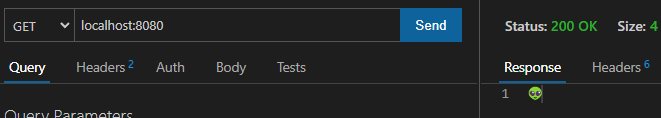

GET /all :

* Parámetros: ninguno
* Devuelve: un JSON con la lista de todos los objetos de la base de datos. Cuando la base de datos es nueva, devuelve un arreglo vacío: []

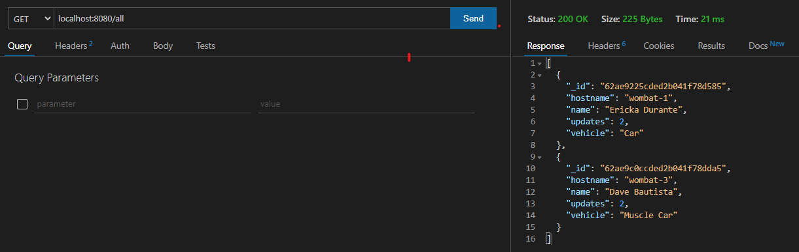

GET /one :

* Parámetros: requiere el hostname en la cadena get. Ejemplo: ?hostname=wombat-1
* Devuelve: JSON con el detalle del registro. Cuando la base de datos es nueva o no encuentra la opción solicitada, devuelve un arreglo vacío: []

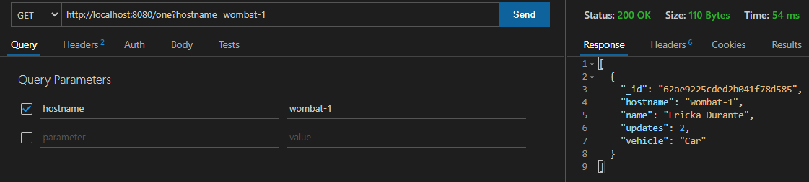

PUT /one :

* Parámetros: JSON con el detalle del registro a insertar. Los valores posibles son: name, vehicle, hostname. Si se omite hostname, este será insertado automáticamente con el nombre del host del servidor (no tiene sentido práctico).
* Devuelve: estructura con status 201 'OK', id del registro en caso de inserción o status 200 '0K' con id null en caso de actualización.

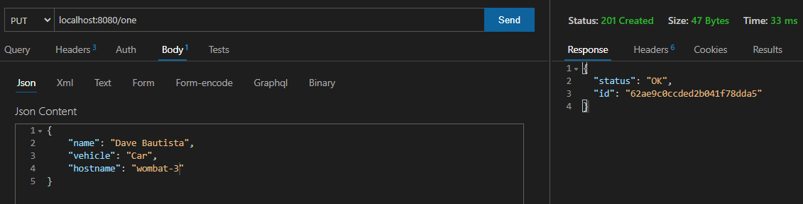

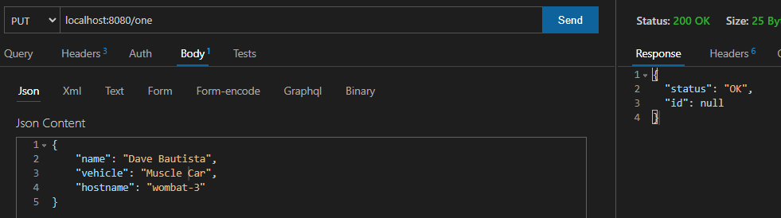

DELETE /one :

* Parámetros: Cadena GET con el hostname. Ejemplo: ?hostname=wombat-3
* Devuelve: status 200 'OK' y estructura JSON con el valor {"status": "OK"}

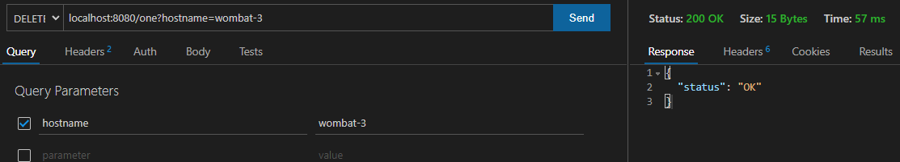

## Manejo de errores

El sistema devuelve una estructura JSON con la estructura:

```json
{"status": "NOK", "message": "<detalle del error>"}
```

## Detalles a considerar

* Si desea correr el programa con el depurador local, por favor cambiar, en server.js, la constante mongoHost = "mongo" a mongoHost = "localhost". Esta debe apuntar a mongo para satisfacer el requerimiento de la configuración de docker compose como se estableció en el archivo docker-compose.yml.

## Pantallas de programas instalados y configuraciones

Mongo

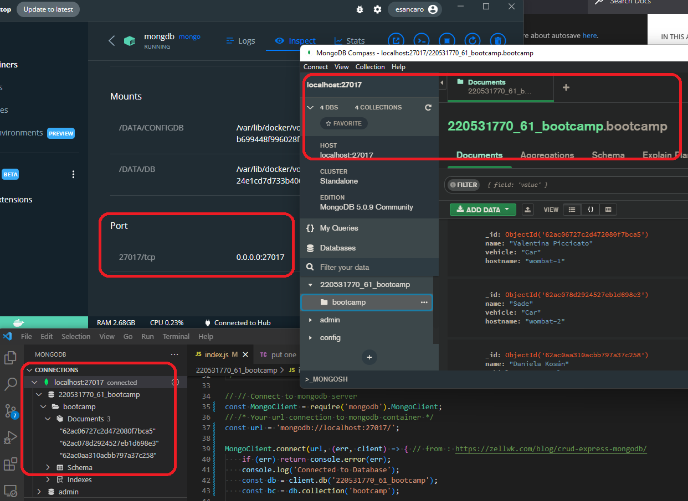

Detalle del grupo de contenedores de compose. Mongo y Node.

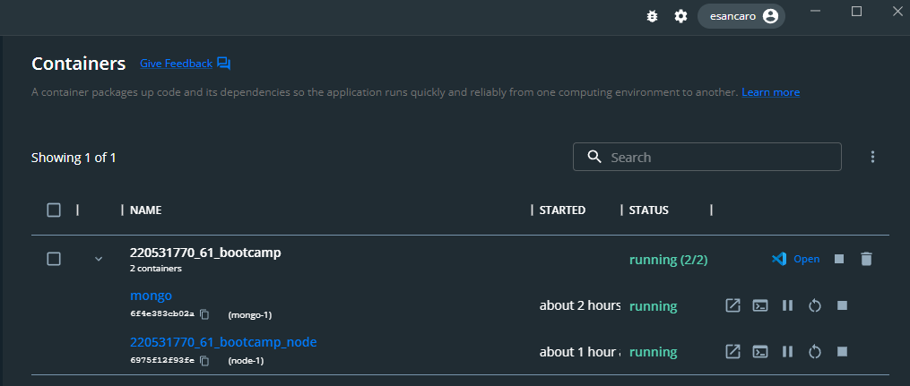

kubectl

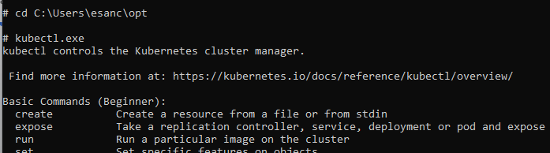

minikube

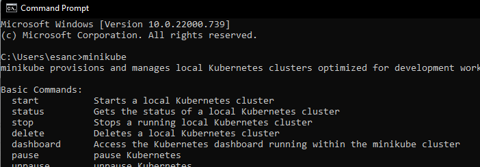

Línea de comandos con zsh

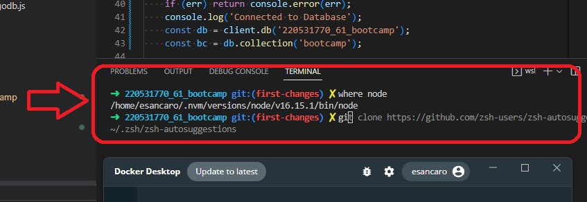

## Referencias

* Conocimiento general
  * <https://zellwk.com/blog/crud-express-mongodb/>
  * <https://www.mongodb.com/docs/manual/reference/method/db.collection.updateOne/>
  * <https://www.mongodb.com/docs/manual/tutorial/remove-documents/>
  * <https://nodejs.org/api/process.html>
* Para docker compose. Conectividad es posible configurando los contenedores con esta opción.
  * <https://stackoverflow.com/questions/66803166/i-have-mongo-db-in-a-docker-container-and-i-want-to-connect-my-app-which-is-runn>
  * <https://www.bogotobogo.com/DevOps/Docker/Docker-Compose-Node-MongoDB.php>
  * <https://docs.docker.com/compose/>
  * <https://stackoverflow.com/questions/51011552/mongodb-on-with-docker-failed-to-connect-to-server-localhost27017-on-first-c>